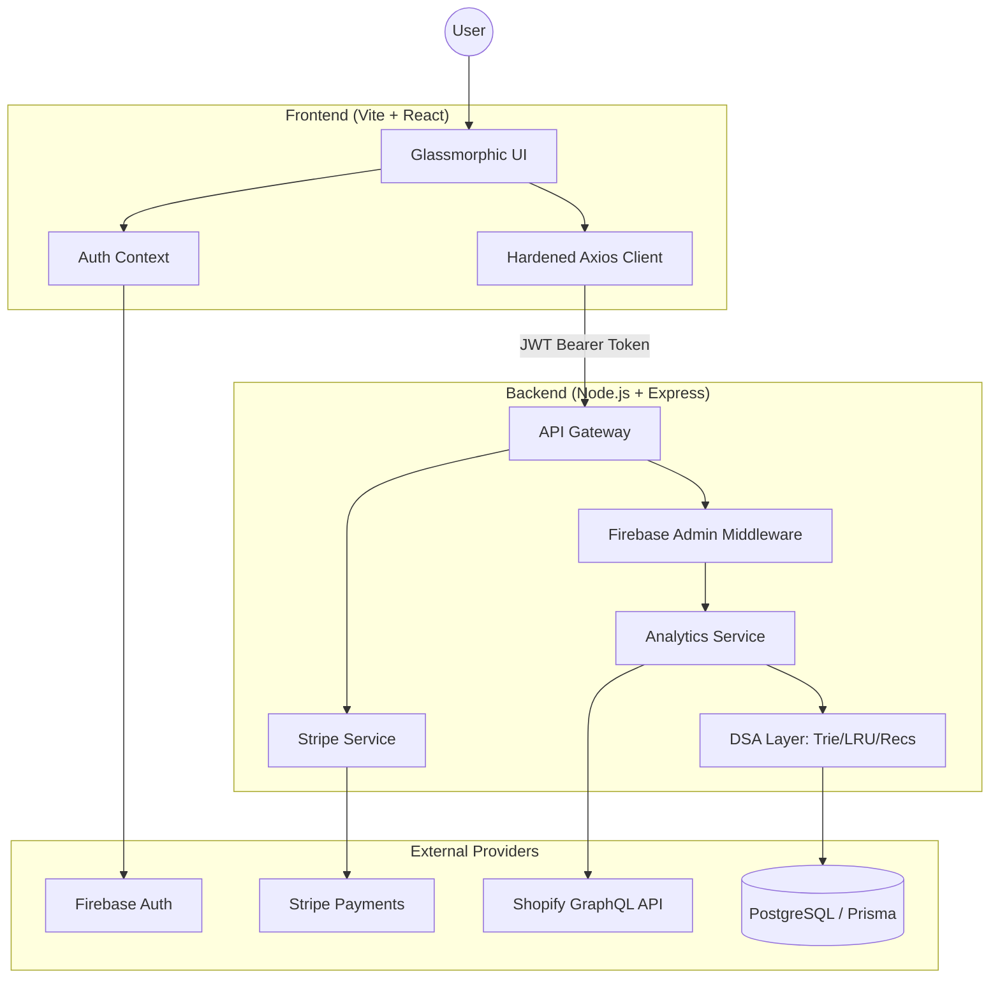

# 🚀 Shopify Analytics SaaS Engine

A professional, production-grade **Shopify Analytics & Recommendation System** built with a modern stack. This platform provides real-time insights, AI-driven product recommendations, and a secure subscription-based monetized dashboard.

[](https://www.typescriptlang.org/)
[](https://reactjs.org/)
[](https://nodejs.org/)
[](https://firebase.google.com/)
[](https://stripe.com/)
[](https://render.com/)

---

## ✨ Core Features

### 🔐 Secure Multi-Channel Authentication
- **Social Login**: Integrated Google Sign-in.
- **Email/Password**: Full registration and recovery flows via Firebase.
- **Guest Access**: "Explore as Guest" one-click demo access for immediate platform evaluation.

### 💳 Monetized SaaS Dashboard
- **Subscription Plans**: Growth, Pro, and Enterprise tiers.
- **Stripe Integration**: Real-time checkout sessions and subscription lifecycle management.
- **Free Trials**: Automated 30-day trial logic for new business users.

### 📊 Real-Time Analytics & DSA
- **Sales Trends**: Moving averages and trend overlays using sliding window algorithms.
- **Top Products**: Dynamic performance tracking.
- **Test Insights Mode**: A global toggle that switches the entire app to a high-fidelity mock data mode for presentations or testing without a live Shopify store connected.

### 🔍 Search & Recommendations
- **Prefix Autocomplete**: High-performance search powered by a **Trie** data structure.
- **Co-Purchase Engine**: Collaborative filtering using **Jaccard Similarity** to suggest "Customers also bought" items.

---

## 🏗️ System Architecture



---

## 🛠️ Tech Stack

- **Frontend**: React 18, TypeScript, Tailwind CSS, Lucide Icons, Recharts, Framer Motion.
- **Backend**: Node.js, Express, TypeScript, Firebase Admin.
- **Database**: Prisma ORM with PostgreSQL.
- **Infrastructure**: Docker, Redis (Caching), Render (Deployment).

---

## 🚀 Getting Started

### 1. Prerequisites
- Node.js >= 18
- Firebase Project
- Stripe Account

### 2. Installation
```bash
# Install root dependencies
npm install

# Install sub-project dependencies
cd client && npm install
cd ../server && npm install
```

### 3. Environment Setup
Create a `.env` in the root (or `server/` and `client/` folders):

**Server (`server/.env`)**
```env
PORT=5000
NODE_ENV=development
FRONTEND_URL=http://localhost:5173
DATABASE_URL=postgresql://...
STRIPE_SECRET_KEY=sk_test_...
FIREBASE_PROJECT_ID=...
FIREBASE_CLIENT_EMAIL=...
FIREBASE_PRIVATE_KEY=...
```

**Client (`client/.env`)**
```env
VITE_API_URL=http://localhost:5000
VITE_FIREBASE_API_KEY=...
VITE_FIREBASE_PROJECT_ID=...
```

### 4. Running the App
```bash
# From root
npm run dev
```

---

## 🧠 DSA Deep Dives

### 1. Trie — Autocomplete Search
We use a Trie (Prefix Tree) to provide $O(L)$ search time where $L$ is the length of the query string. This is significantly faster than standard SQL `%LIKE%` queries for large datasets.
- **Location**: `server/src/dsa/trie.ts`
- **Feature**: Supports frequency-based ranking of results.

### 2. Recommendation Engine (Jaccard Similarity)
Our recommendation logic connect products via a co-purchase graph.
- **Algorithm**: $J(A, B) = \frac{|A \cap B|}{|A \cup B|}$
- **Location**: `server/src/dsa/recommendation.ts`

### 3. LRU Cache
Expensive Shopify API calls are cached in a custom-built Least Recently Used (LRU) cache combining a HashMap and a Doubly Linked List for $O(1)$ access and eviction.
- **Location**: `server/src/dsa/lru-cache.ts`

---

## ☁️ Deployment (Render)

### Backend (Web Service)
- **Repo Root**: `server`
- **Build**: `npm install && npm run build`
- **Start**: `npm start`

### Frontend (Static Site)
- **Repo Root**: `client`
- **Build**: `npm install && npm run build`
- **Publish Directory**: `dist`

---

## 🧪 Testing
```bash
# Run DSA unit tests
npm run test:dsa

# Linting
npm run lint
```

## 📜 License
MIT © 2026 Admin
